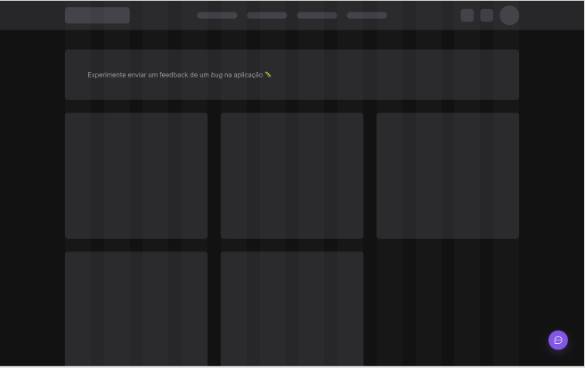
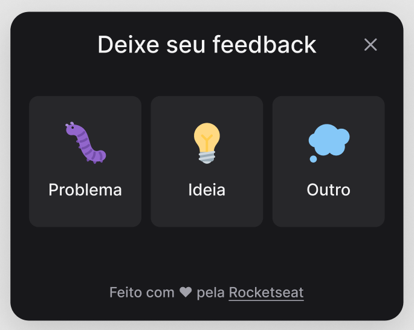
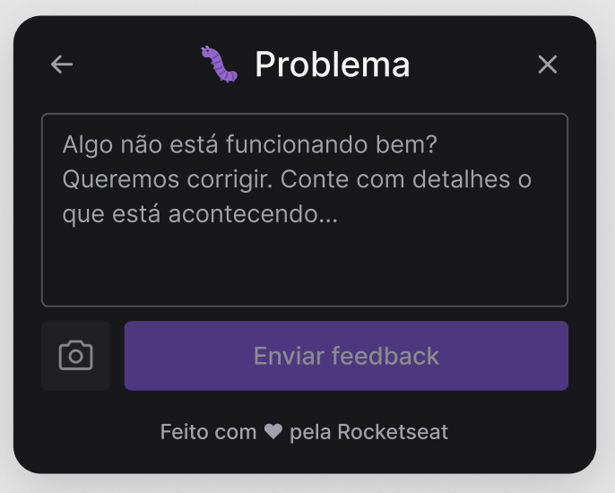
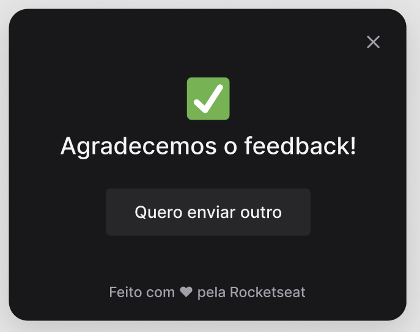

  <a href="#-tecnologias">Tecnologias</a>&nbsp;&nbsp;&nbsp;|&nbsp;&nbsp;&nbsp;
  <a href="#-projeto">Projeto</a>&nbsp;&nbsp;&nbsp;|&nbsp;&nbsp;&nbsp;
  <a href="#-layout">Layout</a>

# Feedget
#### Este projeto foi desenvolvido durante a 8ª Edição da Next Level Week realizada pela Rocketseat.  

 

  
  
  
  

## 🚀 Tecnologias

Esse projeto foi desenvolvido com as seguintes tecnologias:

* Back-end
  - [Node](https://nodejs.org/)
  - [Prisma](https://www.prisma.io/)
* Front-end
  - [React](https://reactjs.org/)
  - [Vite](https://vitejs.dev/)
* Mobile
  - [React-Native](https://reactnative.dev/)
  - [Expo](https://expo.dev/)

## 💻 Projeto

Feedget é uma ferramenta utilizada para coletar comentários e/ou sugestões de aplicações e enviá-las por E-mail para o seu responsável, tanto no ambiente web quanto mobile.

## 🔖 Layout

Você pode visualizar o layout do projeto através [desse link](https://www.figma.com/file/KBFkI4wOJaJbgGVi112ACv/Feedback-Widget-(Community)). É necessário ter uma conta no [Figma](https://figma.com) para acessá-lo.

---